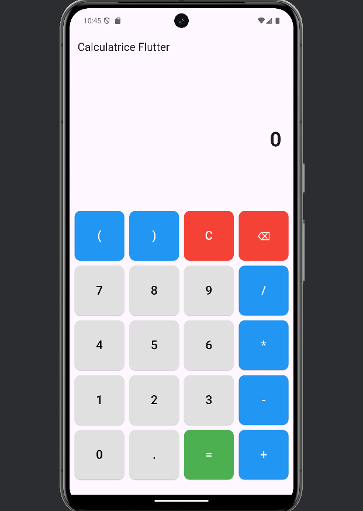

# Calculatrice Flutter

## Présentation

Cette application implémente une calculatrice complète en Flutter, offrant une interface intuitive et des fonctionnalités avancées. Elle permet de réaliser des calculs arithmétiques, de gérer les priorités d'opérations, et d'utiliser des parenthèses pour des expressions complexes.

)

## Fonctionnalités

- **Opérations arithmétiques de base** : addition, soustraction, multiplication, division
- **Calculs en chaîne** avec respect des priorités mathématiques
- **Support des parenthèses** pour des expressions complexes
- **Affichage en temps réel** des calculs et résultats
- **Historique des calculs** précédents
- **Interface intuitive** avec retour visuel
- **Gestion intelligente des nombres décimaux**

## Choix Techniques

### Architecture

L'application utilise l'architecture standard de Flutter avec un `StatefulWidget` pour la calculatrice, permettant une gestion dynamique de l'état. Les principaux composants sont :

1. **Interface utilisateur (UI)** : Divisée en deux sections principales :
    - Zone d'affichage (expression en cours, résultat, historique)
    - Grille de boutons (chiffres, opérateurs, parenthèses, fonctions)

2. **Gestion de l'état** : Utilisation de variables d'état pour suivre :
    - L'expression en cours de saisie
    - Le résultat calculé
    - L'historique des calculs
    - Le statut des parenthèses
    - Le comportement après égal

3. **Traitement des expressions** : Implémentation d'un évaluateur qui :
    - Respecte les priorités des opérations
    - Gère les parenthèses imbriquées
    - Traite correctement les nombres négatifs et décimaux

### Widgets Utilisés

- `Column` pour l'organisation verticale de l'interface
- `GridView.builder` pour la disposition des boutons en grille
- `AnimatedContainer` pour les animations des boutons
- `ListView.builder` pour l'historique des calculs

## Difficultés Rencontrées et Solutions

### 1. Évaluation des Expressions Mathématiques

**Problème** : Implémenter un parser respectant les priorités d'opération et les parenthèses.

**Solution** : Approche récursive en deux étapes :
- Traitement des expressions entre parenthèses de l'intérieur vers l'extérieur
- Application des priorités d'opération en deux passes :
    1. Multiplications et divisions
    2. Additions et soustractions

### 2. Gestion des Nombres Décimaux

**Problème** : Affichage trop long des nombres à virgule causant des débordements d'écran.

**Solution** :
- Arrondi intelligent à 4 décimales
- Suppression des zéros non significatifs
- Formatage spécial des nombres entiers

### 3. Comportement Post-Calcul

**Problème** : Après un calcul, le comportement doit être différent selon que l'utilisateur saisisse un chiffre ou un opérateur.

**Solution** :
- Flag `_lastPressedEquals` pour suivre l'état
- Si un chiffre est saisi après "=", nouveau calcul
- Si un opérateur est saisi après "=", continuation avec le résultat précédent

cette solution n'est pour le moment pas fonctionnelle

### 4. Gestion des Parenthèses

**Problème** : Assurer l'intégrité des parenthèses et gérer les cas incomplets.

**Solution** :
- Compteur de parenthèses ouvertes
- Restrictions sur l'ajout de parenthèses pour éviter les erreurs
- Fermeture automatique des parenthèses manquantes lors de l'évaluation

## Améliorations Réalisées

1. **Interface Utilisateur** :
    - Animations fluides 
    - Différenciation visuelle des boutons par catégorie
    - Affichage en temps réel de l'expression et du résultat

2. **Fonctionnalités** :
    - Gestion des nombres décimaux
    - Historique des calculs
    - Bouton d'effacement pour corrections rapides

## Installation et Utilisation

1. Clonez ce dépôt :
   ```
   git clone https://github.com/votre-username/flutter_calculatrice.git
   ```

2. Naviguez vers le répertoire du projet :
   ```
   cd flutter_calculatrice
   ```

3. Installez les dépendances :
   ```
   flutter pub get
   ```

4. Lancez l'application :
   ```
   flutter run
   ```

)
